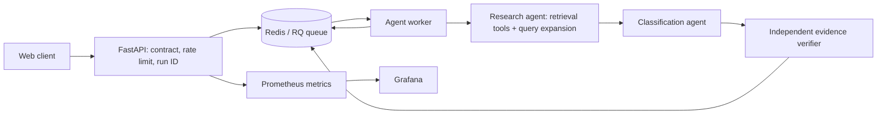

# Export Classification Check Service (Mini Project 07)

An evidence-first, asynchronous REST service for proposed export tariff classification. It does **not** file declarations and must not be treated as legal advice or a customs ruling. A licensed customs broker makes the final decision.

## Important status / honest limitations

This repository is a runnable engineering starter implementing the API, schema validation, Redis/RQ job queue, LangGraph agent hand-off, iterative retrieval, fail-closed verification, web client, metrics, monitoring, feedback endpoint, evaluation scenarios and operational docs. **It does not ship an official CBIC/DGFT tariff corpus, and it deliberately does not invent HS codes.** Before legal classification can be demonstrated, populate `corpus/` with verified current official source text. The flask scenario should be escalated until its named-article heading, GRI, and relevant notes are retrieved and independently verified. The lexical retrieval is a baseline; replace/augment it with Chroma or FAISS embeddings plus metadata filters as the next engineering step.

## Architecture



**Deployment boundaries:** API is independently scalable and does not block on long runs; Redis isolates submission from worker failures and buffers bursts; workers can scale horizontally; Prometheus/Grafana are operational services. `agent-worker` is the Compose scaling target.

## Quick start

Prerequisites: Docker Desktop / Docker Engine with Compose v2.

1. Copy `.env.example` to `.env`; change the Grafana password.
2. Put official CBIC/DGFT text documents into `corpus/` (plain `.txt` or `.md`, excluding README files). Keep source filenames/version metadata and do not invent or paraphrase tariff language.
3. From repository root:

   ```bash
   docker compose up --build -d
   docker compose ps
   ```

4. Open the web UI at http://localhost:8000. API docs: http://localhost:8000/docs. Health: http://localhost:8000/health. Prometheus: http://localhost:9090. Grafana: http://localhost:3000.
5. Submit a request through the UI or API. The API returns `202` and a run ID; poll the returned `status_url`. When the official corpus is empty or insufficient, escalation is expected.
6. Stop: `docker compose down`. Remove local data volumes only if intended: `docker compose down -v`.

### PowerShell API example

```powershell
$body = @{
  description = "Stainless steel vacuum flask with a moulded plastic outer body"
  materials = @("stainless steel", "plastic")
  intended_use = "Reusable beverage container"
  country_of_export = "India"
  destination_country = "United States"
  client_id = "demo"
} | ConvertTo-Json
$job = Invoke-RestMethod -Method Post -Uri http://localhost:8000/v1/runs -ContentType 'application/json' -Body $body
$job
Invoke-RestMethod -Uri ("http://localhost:8000" + $job.status_url)
```

## API data contract

- `POST /v1/runs` — JSON `ProductRequest`, responds `202` with `run_id`, `status_url`, queue job ID. Invalid data gets `422` and does not enter the queue.
- `GET /v1/runs/{run_id}` — queued/running/completed/failed status and final recommendation. The public run ID is mapped to the RQ job ID in Redis; completed output is also cached under the public run ID so polling does not depend on the finished job remaining in the queue registry.
- `POST /v1/feedback` — `{ "run_id": "...", "satisfactory": true, "reason": "..." }`.
- `GET /v1/feedback/summary` — aggregate feedback.
- `GET /v1/quarantine/summary` — recent validation/guardrail rejection summary for local coursework evidence.
- `GET /health`, `GET /metrics`.

Malformed Pydantic requests are rejected with `422`, their field-level errors are quarantined, and no job is enqueued. Deterministic checks scan free-text description, intended use and materials for a small set of common prompt-injection/threat patterns; these rules are a narrow demonstration, not a complete injection or toxicity detector.

Fields: `description` (8–1000 chars), `materials` (up to 20 strings), optional `intended_use`, `country_of_export` (defaults India), required `destination_country` (must differ from origin), optional non-negative `value_usd` (max 1 billion), optional positive `quantity` (max 1 billion), and `client_id`. Do not send sensitive data.

## Agent topology and safety

1. **Research agent** calls the request-field tool and corpus-search tool, then expands its query when retrieval is weak. The named-article search is an explicit safeguard for vacuum flasks.
2. **Classification agent** checks scope and evidence. It does not infer a code solely from material similarity.
3. **Verification agent** checks every returned citation ID against retrieved corpus text. If verification fails, code output is suppressed and the route escalates.

Tools: `search_corpus`, `lookup_clause`, `get_request_fields`. Current graph hand-off is explicit and bounded by LangGraph recursion limit; each queue job has a 90-second timeout by default. If a worker/provider fails, the job is marked failed and no confident answer is returned. This starter uses no external LLM provider, so provider circuit breaker and token-cost measurements are not applicable yet; add them when integrating a provider, with timeout/retry/backoff/circuit-breaker tests.

## Recommendation routes

- `clear-for-filing`: only when applicable official heading/rules/notes support a verified classification. This starter does not automatically emit this route.
- `seek-product-clarification`: required product facts are missing or ambiguous.
- `specialist-classification-review`: unsupported scope, competing headings, absent named-article evidence, or unresolved legal interpretation.

The output is a proposed classification only, never permission to file. Do not implement a fallback that guesses a code.

## Corpus indexing / freshness

The starter reads local text files at run time and exports `export_corpus_chunks`; the corpus README is excluded. Retrieval is lexical token overlap, not semantic/vector retrieval: it can return passages that share common words but do not substantively support the product classification. Citation verification currently checks that cited passage IDs resolve to non-empty indexed text; it does not assess legal authority, passage relevance, entailment, source freshness, or whether every claim is supported. A `verification_passed` value therefore means only that this narrow ID/existence check passed. Manually review source authority, passage relevance, and claim support. For production coursework completion, implement a CLI ingestion pipeline with document hashes, source versions, timestamps, OCR for scanned documents, section/chapter-note metadata, stable chunk IDs, incremental embeddings and Chroma/FAISS persistence.

## Evaluation

`evals/scenarios.json` contains 20 starter cases, expected safe routes, and rationales. These are **test hypotheses, not legally adjudicated gold HS codes**. Run your batch evaluator after adding the official corpus. Record, at minimum:

- Groundedness = claims supported by cited corpus passages / total factual claims reviewed.
- Context relevance = relevant retrieved passages / all retrieved passages, manually labelled or by a documented evaluator.
- Faithfulness = answer claims entailed by context / answer claims evaluated.
- Hallucination rate = unsupported factual claims / all factual claims evaluated.

Compare at least two versioned prompts on the same fixed set, then make one deliberate change and report all four metrics before/after. Do not claim results before running the evaluator. `prompt_version` is returned with each run.

## Observability / load testing

Prometheus scrapes `/metrics`. Add dashboards for end-to-end p50/p95, error rate, throughput, availability and container resources. Grafana is at port 3000 (`admin` / `.env` password). Declare your target before testing; suggested starting target for the report: **p95 <= 30 seconds from submission to final result at concurrency 5**, justified as an interactive analyst workflow, then measure rather than assuming it is met. Use Locust with a fixed-delay stub instead of a live LLM so results measure the service. Test concurrency steps (1, 5, 10, 20), and compare one worker vs `docker compose up --build --scale agent-worker=3`; report RPS, p50, p95, failure point and bottleneck. A Locust journey script is included, but a separate deterministic model-stub service and measured load results remain incomplete.

## Tests

For local tests, prefer a clean Python 3.11 virtual environment to avoid conflicts with packages already installed in Anaconda. Install `requirements.txt` and `pytest`, then run `python -m pytest -q`. Tests cover deterministic guardrails, public-run-ID to queue-job-ID lookup, completed-result retrieval, evaluation retry handling, and honest failure reporting. They do not prove tariff correctness, retrieval quality, or multi-container behaviour. Also run `docker compose config` and the 10-item live demonstration checklist from the assignment.

## Runbook

### Failure mode 1 — request remains queued
- **Symptom:** status stays queued; API reports Redis unavailable or worker logs show connection errors.
- **Confirm:** `docker compose ps`, `docker compose logs redis agent-worker api`, `Invoke-RestMethod http://localhost:8000/health`.
- **Recover:** `docker compose restart redis agent-worker api`; retry only after health is green. Do not manually claim a failed job completed.

### Failure mode 2 — no citation / unexpected escalation
- **Symptom:** no citations or specialist review for an otherwise familiar item.
- **Confirm:** inspect the returned `citations`, `steps`, worker logs, corpus files, source version and `/metrics` corpus chunk gauge.
- **Recover:** obtain the current official CBIC/DGFT source, extract text with notes/headings preserved, place it under `corpus/`, restart workers, and rerun the fixed evaluation set. Never fix this by hardcoding a desired HS code.

## Incident log

Append genuine development incidents with timestamp, observed symptom, reproduction, root cause, fix and verification. `INCIDENT_LOG.md` records the genuine missing-Redis dependency failure seen during local test collection and the verification performed at that time.

## Known limitations / next steps

- Official source corpus must be supplied and verified.
- Retrieval is lexical rather than vector-based; integrate Chroma/FAISS and local embeddings.
- Add provider abstraction, model timeout/retry with exponential backoff, circuit breaker and provider-down demo if an LLM is added.
- Persist full run traces and per-step cost/tokens; current traces contain tool/query/passage IDs but do not calculate LLM cost.
- Add OCR, idempotent vector ingestion CLI, separate deterministic model-stub service, prompt A/B evaluator, comprehensive toxicity/injection controls, and dashboard provisioning.
- Feedback is stored in Redis when available; otherwise in-process fallback is not durable.
- Rate limiting is an in-memory per-API-process demonstration, not a distributed production limiter.

### Load test and batch evaluation helpers

- Install Locust in a test environment (`pip install locust`) and run `locust -f locustfile.py --host http://localhost:8000`. The script submits and polls, so the reported user journey includes final completion. Repeat with one worker and with `docker compose up --build --scale agent-worker=3 -d` and save each report.
- With the stack running, run `python evals/run_batch.py` from the repository root in a Python environment with network access to localhost. It keeps the API rate limit enabled, spaces submissions below the default 10/minute limit, retries HTTP 429 and temporary server errors with bounded backoff (honouring `Retry-After`), and records failures without counting them as route matches. It writes all raw scenario results to `evals/latest_results.json` and prints a per-scenario summary. Route match is not legal correctness. Inspect every failure and manually label passage relevance and claim support before reporting groundedness, context relevance, faithfulness, or hallucination rate.
